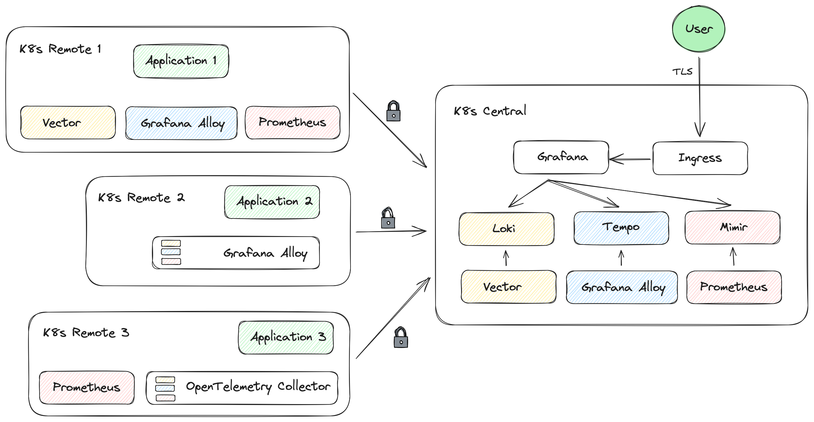

# LGTM PoC: Multi-Tenant Centralized Observability

**Transform your multi-cluster Kubernetes observability with a centralized, scalable, and secure LGTM stack.**

This Proof of Concept demonstrates how to deploy Grafana's LGTM Stack (**L**oki + **G**rafana + **T**empo + **M**imir) on a central Kubernetes cluster, enabling secure collection of metrics, logs, and traces from multiple remote clusters with proper tenant isolation.

## 🎯 What You'll Achieve

- **Centralized Observability**: Consolidate telemetry data from multiple Kubernetes clusters
- **Multi-Tenant Architecture**: Secure data isolation between different teams/environments
- **Zero Trust Security**: Encrypted inter-cluster communication via Service Mesh or Cilium ClusterMesh
- **Scalable Design**: Battle-tested components that grow with your infrastructure
- **Flexible Deployment**: Multiple agent configurations (Prometheus + Vector + Alloy, Alloy-only, or OpenTelemetry Collector)

## 🏗️ Key Technologies

| Component | Purpose | Why This Choice |
|-----------|---------|-----------------|
| **[Mimir](https://grafana.com/docs/mimir/latest/)** | Metrics storage | Horizontally scalable Prometheus backend with multi-tenancy |
| **[Loki](https://grafana.com/docs/loki/latest/)** | Log aggregation | Simpler than ELK stack, designed for cloud-native environments |
| **[Tempo](https://grafana.com/docs/tempo/latest/)** | Distributed tracing | Cost-effective trace storage with seamless Grafana integration |
| **[Grafana](https://grafana.com/)** | Visualization | Unified dashboards for metrics, logs, and traces |

**Service Mesh Options**: [Linkerd](https://linkerd.io/), [Istio](https://istio.io/), or [Cilium ClusterMesh](https://cilium.io/use-cases/cluster-mesh/) for secure inter-cluster communication.

## Architecture Overview



### Core Design Principles

Our architecture follows these principles:
- **Security First**: All inter-cluster communication is encrypted and authenticated
- **Tenant Isolation**: Each cluster operates as a separate tenant with data isolation
- **Observability Coverage**: Complete telemetry collection (metrics, logs, traces)
- **Operational Simplicity**: Minimal configuration required for new cluster onboarding

### Deployment Scenarios

We demonstrate three different agent deployment patterns:

#### Scenario 1: Traditional Stack
- **Prometheus**: Kubernetes metrics + ServiceMonitor/PodMonitor CRDs
- **Vector**: Log collection and forwarding  
- **Grafana Alloy**: Trace collection and processing

#### Scenario 2: Unified Agent (Grafana Alloy)
- **Single Agent**: Alloy handles all telemetry types
- **Simplified Operations**: Fewer components to manage
- **Prometheus Compatibility**: Supports existing ServiceMonitor configurations

#### Scenario 3: OpenTelemetry Native
- **OTEL Collector**: Industry-standard telemetry pipeline
- **OTLP Protocol**: Direct application instrumentation support
- **Hybrid Approach**: Can coexist with Prometheus for cluster metrics

We have a central cluster running Grafana's LGTM stack on Kubernetes. Then, several client or remote clusters connected via "Cluster Mesh" to the central cluster to send metrics, logs, and traces to the LGTM stack.

The remote clusters show different possibilities for deploying the solution.

### Detailed Architecture

This PoC implements a **hub-and-spoke model** where:
- **Central cluster** (`lgtm-central`): Hosts the complete LGTM stack with Grafana UI
- **Remote clusters**: Send telemetry data to the central cluster via secure service mesh connections
- **Tenant isolation**: Each cluster operates as a separate tenant in Mimir, Loki, and Tempo

#### Data Flow Patterns

**Scenario 1: Traditional Stack**
Remote clusters use specialized agents for each telemetry type:
- **Prometheus** → Remote Write → **Central Mimir** (metrics)
- **Vector DaemonSet** → **Central Loki** (logs)  
- **Grafana Alloy** → **Central Tempo** (traces)

**Scenario 2: Unified Agent (Grafana Alloy)**
Hybrid architecture using two Alloy installations:
- **Alloy DaemonSet** → Pod logs, kubelet metrics, cAdvisor metrics (node-local)
- **Alloy Deployment** → ServiceMonitor/PodMonitor scraping, traces, events (cluster-wide)
- Native support for Prometheus Operator CRDs (no Prometheus Operator required)
- Single agent type reduces operational complexity

**Scenario 3: OpenTelemetry Native**
Hybrid approach combining cloud-native standards:
- **Prometheus** → **Central Mimir** (cluster metrics)
- **OTEL Collector** → **Central LGTM Stack** (application telemetry via OTLP)

#### Demo Clusters

| Cluster | Purpose | Demo Application |
|---------|---------|------------------|
| `lgtm-central` | LGTM Stack + Grafana UI | Internal monitoring |
| `lgtm-remote` | Scenario 1 demonstration | [TNS Demo App](https://github.com/grafana/tns) |
| `lgtm-remote-alloy` | Scenario 2 demonstration | [TNS Demo App](https://github.com/grafana/tns) |
| `lgtm-remote-otel` | Scenario 3 demonstration | [OpenTelemetry Demo](https://opentelemetry.io/docs/demo/) |

### Infrastructure Details

**Kubernetes Distribution**: [Kind](https://kind.sigs.k8s.io/) for local development
- Better performance than minikube for multi-node clusters
- Excellent ARM Mac compatibility
- Native Docker integration

**Container Networking Interface (CNI)**: [Cilium](https://cilium.io/)
- eBPF-based networking for performance
- Built-in LoadBalancer capabilities (eliminates MetalLB dependency)
- Optional: Can be disabled in favor of default CNI + MetalLB

**Load Balancer IP Segments**:
- Central cluster: `x.x.x.248/29`
- Remote cluster: `x.x.x.240/29`
- Alloy remote cluster: `x.x.x.224/29`
- OTEL remote cluster: `x.x.x.232/29`

**Security**: Zero Trust communication via Service Mesh
- **Automatic encryption** for inter-cluster communication
- **Mutual TLS (mTLS)** without manual certificate management
- **Service discovery** across cluster boundaries

### Service Mesh Options

**Why Service Mesh?** Traditional Kubernetes networking lacks:
- Automatic encryption between clusters
- Identity-based access control
- Advanced traffic management

**Cilium ClusterMesh vs Traditional Service Mesh**:
- **Cilium**: eBPF kernel-level performance, WireGuard encryption between nodes
- **Linkerd/Istio**: Full mTLS encryption including same-node pod communication

## Prerequisites

### System Requirements
- **CPU**: 8 cores minimum (tested on Intel i3-8350K @ 4.00GHz and Intel i9 @ 2.4GHz)
- **RAM**: 32GB recommended (16GB minimum for central + one remote cluster)
- **OS**: macOS or Linux (tested on Intel-based MBP with macOS and OrbStack, and [Rocky Linux](https://rockylinux.org/) 9/10)

> 💡 **Performance Tip**: [OrbStack](https://orbstack.dev/) significantly outperforms Docker Desktop on macOS and provides native IP access to containers.

### Required Tools

| Tool | Purpose | Installation |
|------|---------|-------------|
| **[Docker](https://www.docker.com/)** | Container runtime | [Download](https://docs.docker.com/get-docker/) |
| **[Kind](https://kind.sigs.k8s.io/)** | Local Kubernetes clusters | `brew install kind` or [releases](https://kind.sigs.k8s.io/docs/user/quick-start/) |
| **[Kubectl](https://kubernetes.io/docs/tasks/tools/)** | Kubernetes CLI | [Installation guide](https://kubernetes.io/docs/tasks/tools/) |
| **[Helm](https://helm.sh/)** | Package manager for Kubernetes | [Installation guide](https://helm.sh/docs/intro/install/) |
| **[Step CLI](https://smallstep.com/docs/step-cli)** | Certificate generation | [Installation guide](https://smallstep.com/docs/step-cli/installation/) |
| **[Jq](https://jqlang.github.io/jq/)** | JSON processing | `brew install jq` or [download](https://jqlang.github.io/jq/download/) |

### Service Mesh Tools (Choose One)

| Service Mesh | CLI Tool | When to Use |
|--------------|----------|-------------|
| **[Linkerd](https://linkerd.io/)** | [Linkerd CLI](https://linkerd.io/2.16/getting-started/#step-1-install-the-cli) | Simplicity, automatic mTLS, low resource overhead |
| **[Istio](https://istio.io/)** | [Istio CLI](https://istio.io/latest/docs/setup/install/istioctl/) | Advanced traffic management, enterprise features |
| **[Cilium](https://cilium.io/)** | [Cilium CLI](https://docs.cilium.io/en/stable/gettingstarted/k8s-install-default/#install-the-cilium-cli) | eBPF-based networking, kernel-level performance |

> ⚠️ **Important for Linkerd Users**: Always use the latest edge release to avoid multicluster regressions:
> ```bash
> curl --proto '=https' --tlsv1.2 -sSfL https://run.linkerd.io/install-edge | sh
> export PATH=$HOME/.linkerd2/bin:$PATH
> ```

## 🚀 Quick Start

### Choose Your Service Mesh

**Default (Linkerd)** - Best for getting started:
```bash
# No additional setup required - Linkerd is the default
```

**Istio with Proxy Mode** - For advanced traffic management:
```bash
export CILIUM_CLUSTER_MESH_ENABLED=no
export ISTIO_ENABLED=yes
```

**Istio with Ambient Mode** - For sidecar-less mesh:
```bash
export CILIUM_CLUSTER_MESH_ENABLED=no
export ISTIO_ENABLED=yes
export ISTIO_PROFILE=ambient
```

**Cilium ClusterMesh** - For eBPF-based networking:
```bash
export CILIUM_CLUSTER_MESH_ENABLED=yes
```

**Disable Cilium** - Use Kind's default CNI + MetalLB:
```bash
export CILIUM_ENABLED=no
```

> 💡 **Note**: All scripts automatically handle these configurations. The above commands disable conflicting service mesh options as needed.

### Deploy the Stack

1. **Generate certificates**:
   ```bash
   ./deploy-certs.sh
   ```

2. **Deploy central cluster** (LGTM Stack):
   ```bash
   ./deploy-central.sh
   ```

3. **Deploy remote cluster** (TNS Demo App with Traditional Stack):
   ```bash
   ./deploy-remote.sh
   ```

4. **Optional: Deploy unified Alloy cluster** (TNS Demo App with Alloy):
   ```bash
   ./deploy-remote-alloy.sh
   ```

5. **Optional: Deploy OTEL demo cluster**:
   ```bash
   ./deploy-remote-otel.sh
   ```

### Access Grafana

Get the ingress gateway IP:

```bash
kubectl get service --context kind-lgtm-central \
  -n observability cilium-gateway-lgtm-external-gateway \
  -o jsonpath='{.status.loadBalancer.ingress[0].ip}'
```

Add to `/etc/hosts`:
```bash
# Add to /etc/hosts (replace with actual IP)
192.168.x.x grafana.example.com
```

Visit: `https://grafana.example.com` (accept the self-signed certificate warning)

> 🐳 **Docker Desktop Users**: Run `./deploy-proxy.sh` and use `127.0.0.1 grafana.example.com` instead.

## 🎯 Success Criteria

After completing the deployment, you should be able to:

### ✅ Access Grafana Dashboard
- Navigate to `https://grafana.example.com` 
- Login with `admin` / `Adm1nAdm1n`
- See healthy data sources in **Configuration > Data Sources**

### ✅ Query Telemetry Data
Verify data collection using Grafana's **Explore** tab:

| Query Type | Example Query | Expected Result |
|------------|---------------|-----------------|
| **Metrics (PromQL)** | `up{cluster="lgtm-central"}` | Show healthy targets from central cluster |
| **Logs (LogQL)** | `{cluster="lgtm-remote"} \| json` | Display structured logs from remote cluster |
| **Traces (TraceQL)** | `{service.name="tns-app"}` | Show distributed traces from TNS application |

### ✅ Multi-Cluster Visibility
Confirm tenant isolation by switching between data sources:
- **Local data sources**: `Mimir Local`, `Loki Local`, `Tempo Local`
- **Remote data sources**: `Mimir Remote TNS`, `Loki Remote TNS`, `Tempo Remote TNS`

### ✅ Service Mesh Connectivity
Use the validation commands in the respective service mesh sections to verify secure inter-cluster communication.

> 📚 **Learn More**: New to observability query languages? Check out [PromQL tutorial](https://prometheus.io/docs/prometheus/latest/querying/basics/), [LogQL guide](https://grafana.com/docs/loki/latest/logql/), and [TraceQL documentation](https://grafana.com/docs/tempo/latest/traceql/).

## 🔗 Understanding Service Mesh Integration

Each service mesh approach provides different trade-offs:

### Linkerd Multi-Cluster
- **Automatic mTLS**: Zero-configuration mutual TLS between clusters
- **Service Mirroring**: Creates `servicename-clustername` mirrors automatically
- **Low Overhead**: Minimal resource consumption with Rust-based proxy
- **Example**: Access central Mimir from remote: `mimir-distributor-lgtm-central.mimir.svc`

### Istio Multi-Cluster  
- **Cross-Network Support**: Designed for clusters across different networks
- **Gateway-Based**: Uses Istio Gateway for secure inter-cluster communication
- **Transparent Routing**: Services accessible via original FQDN across clusters
- **Protocol Intelligence**: Automatic protocol detection with `appProtocol` hints

### Cilium ClusterMesh
- **eBPF Foundation**: Kernel-level networking with superior performance
- **Shared Services**: Manual service replication with `service.cilium.io/shared=false`
- **WireGuard Encryption**: Secure node-to-node communication
- **Limitation**: No pod-to-pod encryption within the same node

## 🎨 Deployment Scenario Details

### Scenario 1: Traditional Multi-Agent Stack

**Architecture**: Specialized agents for each telemetry type

**Components**:
- **Prometheus Operator + Prometheus**: Metrics collection with ServiceMonitor/PodMonitor CRDs
- **Vector DaemonSet**: Log collection from `/var/log` and container logs
- **Grafana Alloy Deployment**: Trace collection (OTLP, Jaeger, OpenCensus)

**Pros**:
- Mature, battle-tested components
- Rich ecosystem of ServiceMonitor configurations
- Separate resource allocation per telemetry type

**Cons**:
- Multiple components to manage and upgrade
- Higher resource overhead (3 different agents)
- Complex troubleshooting across multiple systems

**Deployment**: `./deploy-remote.sh`

**Tenant ID**: `remote01`

---

### Scenario 2: Unified Grafana Alloy

**Architecture**: Hybrid DaemonSet + Deployment with single agent type


**Why Hybrid?** The Grafana Alloy Helm chart supports only one `controller.type` per installation. To achieve complete observability coverage, we deploy two separate Helm releases:

#### Alloy DaemonSet (`alloy-daemonset`)
**Purpose**: Node-local data collection requiring host path access

**Responsibilities**:
- **Pod Logs**: Collects logs from all pods via `loki.source.kubernetes`
  - Mounts `/var/log` and `/var/lib/docker/containers` from host
  - Filters out service mesh proxy logs (linkerd-proxy, istio-proxy)
  - Adds cluster labels for multi-tenant routing
- **Kubelet Metrics**: Scrapes node-level metrics from kubelet API
  - CPU, memory, disk usage per node
  - Requires service account with node proxy access
- **cAdvisor Metrics**: Container runtime metrics
  - Per-container resource usage
  - Network and filesystem statistics

**Key Configuration**:
```yaml
controller:
  type: daemonset
alloy:
  mounts:
    varlog: true
    dockercontainers: true
```

**Resource Profile**: `100m CPU / 128Mi memory per node`

#### Alloy Deployment (`alloy-deployment`)
**Purpose**: Cluster-wide discovery and trace collection

**Responsibilities**:
- **ServiceMonitor Discovery**: Native support via `prometheus.operator.servicemonitors`
  - No Prometheus Operator installation required
  - Automatic target discovery from CRDs
  - Clustering enabled for distributed scrape load
- **PodMonitor Discovery**: Support via `prometheus.operator.podmonitors`
  - Direct pod-level metric collection
  - Label-based pod selection
- **Kubernetes Events**: Captures cluster events via `loki.source.kubernetes_events`
- **Distributed Tracing**: Multi-protocol trace receivers
  - OTLP (gRPC/HTTP): Modern instrumentation
  - Jaeger (Thrift/gRPC): Legacy compatibility
  - OpenCensus: Service mesh telemetry (Linkerd)

**Key Configuration**:
```yaml
controller:
  type: deployment
  replicas: 2
alloy:
  clustering:
    enabled: true
  extraPorts:
    - name: otlp-grpc
      port: 4317
    - name: jaeger-thrift-compact
      port: 6831
```

**Resource Profile**: `200m CPU / 256Mi memory per replica`

**Benefits Over Traditional Stack**:
- ✅ **Single Agent Type**: One component to learn, upgrade, and monitor
- ✅ **Native CRD Support**: Use existing ServiceMonitor/PodMonitor without Prometheus Operator
- ✅ **Reduced Resource Usage**: ~40% less memory than Prometheus + Vector + Alloy combined
- ✅ **Simplified Configuration**: Unified Alloy configuration language for all telemetry
- ✅ **Built-in Clustering**: HA support with automatic scrape target distribution

**Migration Path**: Existing ServiceMonitor/PodMonitor resources work without modification

**Deployment**: `./deploy-remote-alloy.sh`

**Tenant ID**: `remote02`

**Verification**:
```bash
# Check DaemonSet (should have one pod per node)
kubectl --context kind-lgtm-remote-alloy -n observability get ds grafana-alloy-daemonset

# Check Deployment (should have 2 replicas)
kubectl --context kind-lgtm-remote-alloy -n observability get deployment grafana-alloy-deployment

# View DaemonSet logs (log collection)
kubectl --context kind-lgtm-remote-alloy -n observability logs ds/grafana-alloy-daemonset

# View Deployment logs (metrics and traces)
kubectl --context kind-lgtm-remote-alloy -n observability logs deployment/grafana-alloy-deployment
```

---

### Scenario 3: OpenTelemetry Native

**Architecture**: Hybrid Prometheus + OTEL Collector

**Components**:
- **Prometheus**: Cluster-level metrics (kubelet, cAdvisor, node-exporter)
- **OpenTelemetry Collector**: Application telemetry via OTLP protocol
- **OTEL Demo App**: Pre-instrumented microservices showing OTLP in action

**Pros**:
- Industry-standard OTLP protocol
- Rich application instrumentation libraries
- Vendor-neutral approach

**Cons**:
- Dual collection stack (Prometheus + OTEL)
- ServiceMonitor support requires OTEL Collector configuration
- Learning curve for OTLP instrumentation

**Deployment**: `./deploy-remote-otel.sh`

**Tenant ID**: `remote03`

---

## Linkerd Multi Cluster


Linkerd creates a mirrored service automatically when linking clusters, appending the name of the target service to it. For instance, in `lgtm-central`, accessing Mimir locally would be `mimir-distributor.mimir.svc`, whereas accessing it from the `lgtm-remote` cluster would be `mimir-distributor-lgtm-central.mimir.svc`.

Due to a [change](https://buoyant.io/blog/clarifications-on-linkerd-2-15-stable-announcement) introduced by Buoyant about the Linkerd artifacts, the latest `stable` version available via Helm charts is 2.14 (even if the actual latest version is newer). Because of that, we'll be using the `edge` release by default.

### Istio Multi Cluster

Setting `appProtocol: tcp` for all GRPC services (especially `memberlist`) helps with [protocol selection](https://istio.io/latest/docs/ops/configuration/traffic-management/protocol-selection/) and ensuring the presence of [headless services](https://istio.io/latest/docs/ops/configuration/traffic-management/traffic-routing/#headless-services) (i.e., `clusterIP: None`) improves traffic routing guaranteeing that the proxy will have endpoints per Pod IP address, allowing all Grafana applications to work correctly (as some microservices require direct pod-to-pod communication by Pod IP). Modern Helm charts for Loki, Tempo, and Mimir allow configuration `appProtocol`; there are already headless services for all the microservices. The configuration flexibility varies, but everything seems to be working.

The PoC assumes Istio [multi-cluster](https://istio.io/latest/docs/setup/install/multicluster/primary-remote_multi-network/) using multi-network, which requires an Istio Gateway. In other words, the environment assumes we're interconnecting two clusters from different networks using Istio.

Unlike Linkerd, the services declared on the central cluster are reachable using the same FQDN as in the local cluster. The Istio Proxies are configured so that the DNS resolution and routing works as intended.

### Cilium ClusterMesh

When using Cilium ClusterMesh, the user is responsible for creating the service with the same configuration on each cluster (although annotated with `service.cilium.io/shared=false`). That means reaching Mimir from `lgtm-remote` would be exactly like accessing it from `lgtm-central` (similar to Istio).

## Validation

### Linkerd Multi-Cluster

The `linkerd` CLI can help to verify if the inter-cluster communication is working. From the `lgtm-remote` cluster, you can do the following:

```bash
➜  linkerd mc check --context kind-lgtm-remote
linkerd-multicluster
--------------------
√ Link CRD exists
√ Link resources are valid
	* lgtm-central
√ remote cluster access credentials are valid
	* lgtm-central
√ clusters share trust anchors
	* lgtm-central
√ service mirror controller has required permissions
	* lgtm-central
√ service mirror controllers are running
	* lgtm-central
√ all gateway mirrors are healthy
	* lgtm-central
√ all mirror services have endpoints
√ all mirror services are part of a Link
√ multicluster extension proxies are healthy
√ multicluster extension proxies are up-to-date
√ multicluster extension proxies and cli versions match

Status check results are √
```

```bash
➜  linkerd mc gateways --context kind-lgtm-remote
CLUSTER       ALIVE    NUM_SVC      LATENCY
lgtm-central  True           4          2ms
```

When linking `lgtm-remote` to `lgtm-central` via Linkerd Multi-Cluster, the CLI will use the Kubeconfig from the `lgtm-central` to configure the service mirror controller on the `lgtm-remote` cluster.

You can inspect the runtime kubeconfig as follows:

```bash
kubectl get secret --context kind-lgtm-remote \
  -n linkerd-multicluster cluster-credentials-lgtm-central \
  -o jsonpath='{.data.kubeconfig}' | base64 -d; echo
```

To see the permissions associated with the `ServiceAccount` on the central cluster:

```bash
➜  kubectl describe clusterrole linkerd-service-mirror-remote-access-default --context kind-lgtm-central
Name:         linkerd-service-mirror-remote-access-default
Labels:       app.kubernetes.io/managed-by=Helm
              linkerd.io/extension=multicluster
Annotations:  linkerd.io/created-by: linkerd/helm stable-2.14.10
              meta.helm.sh/release-name: linkerd-multicluster
              meta.helm.sh/release-namespace: linkerd-multicluster
PolicyRule:
  Resources                        Non-Resource URLs  Resource Names    Verbs
  ---------                        -----------------  --------------    -----
  events                           []                 []                [create patch]
  configmaps                       []                 [linkerd-config]  [get]
  endpoints                        []                 []                [list get watch]
  pods                             []                 []                [list get watch]
  services                         []                 []                [list get watch]
  replicasets.apps                 []                 []                [list get watch]
  jobs.batch                       []                 []                [list get watch]
  endpointslices.discovery.k8s.io  []                 []                [list get watch]
  servers.policy.linkerd.io        []                 []                [list get watch]
  ```

> Note that the `ServiceAccount` exists on both cluster.

In other words, to create a link from `lgtm-remote` to `lgtm-central`, we run the following assuming the current context is assigned to `lgtm-remote`:
```bash
linkerd mc link --context kind-lgtm-central --cluster-name lgtm-central | kubectl apply --context kind-lgtm-remote -f -
```

With the `--context` parameter, we specify the "target" cluster and assign a name to it (which will be part of the exposed service names in the remote cluster). If we inspect the YAML file generated by the above command, we can see a secret that contains `kubeconfig`; that's how to reach the `lgtm-central` cluster, and that will be taken from your local kubeconfig, but using a user called `linkerd-service-mirror-remote-access-default` (a service account in the `linkerd-multicluster` namespace that exists in both clusters).

Another service account called `linkerd-service-mirror-lgtm-central` for the mirror service will be created.

So, the Linkerd Gateway runs in both clusters, but the Mirror Service runs in the remote cluster (where you created the link from).

> If you're using the OpenTelemetry Demo cluster, replace `lgtm-remote` with `lgtm-remote-otel`.

### Istio Multi-Cluster

Here is a sequence of commands that demonstrate that multi-cluster works, assuming you deployed the TLS remote cluster:

```bash
❯ istioctl remote-clusters --context kind-lgtm-remote
NAME             SECRET                                            STATUS     ISTIOD
lgtm-remote                                                        synced     istiod-64f7d85469-ljhhm
lgtm-central     istio-system/istio-remote-secret-lgtm-central     synced     istiod-64f7d85469-ljhhm
```

If you're running in proxy-mode (using mimir-distributor as reference):

```bash
❯ istioctl --context kind-lgtm-remote proxy-config endpoint $(kubectl --context kind-lgtm-remote get pod -l name=app -n tns -o name | sed 's|.*/||').tns | grep mimir-distributor
192.168.97.249:15443                                    HEALTHY     OK                outbound|8080||mimir-distributor.mimir.svc.cluster.local
192.168.97.249:15443                                    HEALTHY     OK                outbound|9095||mimir-distributor.mimir.svc.cluster.local

❯ kubectl get svc -n istio-system lgtm-gateway --context kind-lgtm-central
NAME           TYPE           CLUSTER-IP      EXTERNAL-IP      PORT(S)                                                           AGE
lgtm-gateway   LoadBalancer   10.12.201.116   192.168.97.249   15021:31614/TCP,15443:32226/TCP,15012:32733/TCP,15017:30681/TCP   21m

❯ kubectl --context kind-lgtm-remote exec -it -n tns $(kubectl --context kind-lgtm-remote get pod -n tns -l name=app -o name) -- nslookup mimir-distributor.mimir.svc.cluster.local
Name:      mimir-distributor.mimir.svc.cluster.local
Address 1: 10.12.92.57

❯ kubectl --context kind-lgtm-central get svc -n mimir mimir-distributor
NAME                TYPE        CLUSTER-IP    EXTERNAL-IP   PORT(S)             AGE
mimir-distributor   ClusterIP   10.12.92.57   <none>        8080/TCP,9095/TCP   17m

❯ kubectl --context kind-lgtm-central get pod -n mimir -l app.kubernetes.io/component=distributor -o wide
NAME                                 READY   STATUS    RESTARTS   AGE   IP           NODE                   NOMINATED NODE   READINESS GATES
mimir-distributor-78b6d8b96b-72cmn   2/2     Running   0          15m   10.11.3.14   lgtm-central-worker2   <none>           <none>
mimir-distributor-78b6d8b96b-k8w6g   2/2     Running   0          15m   10.11.2.59   lgtm-central-worker    <none>           <none>
```

If you're running in ambient-mode:

```bash
❯ kubectl get gatewayclass
NAME              CONTROLLER                     ACCEPTED   AGE
istio             istio.io/gateway-controller    True       4m30s
istio-east-west   istio.io/eastwest-controller   True       4m30s
istio-remote      istio.io/unmanaged-gateway     True       4m30s
istio-waypoint    istio.io/mesh-controller       True       4m30s

❯ kubectl get gateway -A
NAMESPACE      NAME                    CLASS             ADDRESS          PROGRAMMED   AGE
istio-system   istio-eastwestgateway   istio-east-west   192.168.97.248   True         4m13s
```

The following uses the mimir-distributor as reference:

```bash
❯ istioctl zc service --service-namespace mimir --context kind-lgtm-remote
NAMESPACE SERVICE NAME      SERVICE VIP                 WAYPOINT ENDPOINTS
mimir     mimir-distributor 10.12.168.116,10.22.130.140 None     1/1

❯ istioctl zc workload --workload-namespace mimir -o json --context kind-lgtm-remote
[
    {
        "uid": "lgtm-central/SplitHorizonWorkload/istio-system/istio-eastwestgateway/192.168.97.248/mimir/mimir-distributor.mimir.svc.cluster.local",
        "workloadIps": [],
        "networkGateway": {
            "destination": "lgtm-central/192.168.97.248"
        },
        "protocol": "HBONE",
        "name": "lgtm-central/SplitHorizonWorkload/istio-system/istio-eastwestgateway/192.168.97.248/mimir/mimir-distributor.mimir.svc.cluster.local",
        "namespace": "mimir",
        "serviceAccount": "default",
        "workloadName": "",
        "workloadType": "pod",
        "canonicalName": "",
        "canonicalRevision": "",
        "clusterId": "lgtm-central",
        "trustDomain": "cluster.local",
        "locality": {},
        "node": "",
        "network": "lgtm-central",
        "status": "Healthy",
        "hostname": "",
        "capacity": 2,
        "applicationTunnel": {
            "protocol": ""
        }
    }
]

❯ istioctl zc services --service-namespace mimir -o json --context kind-lgtm-remote
[
    {
        "name": "mimir-distributor",
        "namespace": "mimir",
        "hostname": "mimir-distributor.mimir.svc.cluster.local",
        "vips": [
            "lgtm-central/10.12.168.116",
            "lgtm-remote/10.22.130.140"
        ],
        "ports": {
            "8080": 0,
            "9095": 0
        },
        "endpoints": {
            "lgtm-central/SplitHorizonWorkload/istio-system/istio-eastwestgateway/192.168.97.248/mimir/mimir-distributor.mimir.svc.cluster.local": {
                "workloadUid": "lgtm-central/SplitHorizonWorkload/istio-system/istio-eastwestgateway/192.168.97.248/mimir/mimir-distributor.mimir.svc.cluster.local",
                "service": "",
                "port": {
                    "8080": 0,
                    "9095": 0
                }
            }
        },
        "subjectAltNames": [
            "spiffe://cluster.local/ns/mimir/sa/mimir-sa"
        ],
        "ipFamilies": "IPv4"
    }
]
```

From DNS resolution perspective:

```bash
❯ kubectl --context kind-lgtm-remote exec -it -n tns $(kubectl --context kind-lgtm-remote get pod -n tns -l name=app -o name) -- nslookup mimir-distributor.mimir.svc.cluster.local
nslookup: can't resolve '(null)': Name does not resolve

Name:      mimir-distributor.mimir.svc.cluster.local
Address 1: 10.22.130.140 mimir-distributor.mimir.svc.cluster.local
```

### Cilium ClusterMesh

The `cilium` CLI can help to verify if the inter-cluster communication is working. From each context, you can run the following:

```bash
cilium clustermesh status --context ${ctx}
```

The following shows how it looks like when having both remote clusters deployed:

```bash
for ctx in central remote remote-otel; do
  echo "Checking cluster ${ctx}"
  cilium clustermesh status --context kind-lgtm-${ctx}
  echo
done
```

The result is:

```
Checking cluster central
✅ Service "clustermesh-apiserver" of type "LoadBalancer" found
✅ Cluster access information is available:
  - 172.19.255.249:2379
✅ Deployment clustermesh-apiserver is ready
✅ All 4 nodes are connected to all clusters [min:2 / avg:2.0 / max:2]
🔌 Cluster Connections:
  - lgtm-remote: 4/4 configured, 4/4 connected
  - lgtm-remote-otel: 4/4 configured, 4/4 connected
🔀 Global services: [ min:0 / avg:0.0 / max:0 ]

Checking cluster remote
✅ Service "clustermesh-apiserver" of type "LoadBalancer" found
✅ Cluster access information is available:
  - 172.19.255.241:2379
✅ Deployment clustermesh-apiserver is ready
✅ All 2 nodes are connected to all clusters [min:1 / avg:1.0 / max:1]
🔌 Cluster Connections:
  - lgtm-central: 2/2 configured, 2/2 connected
🔀 Global services: [ min:4 / avg:4.0 / max:4 ]

Checking cluster remote-otel
✅ Service "clustermesh-apiserver" of type "LoadBalancer" found
✅ Cluster access information is available:
  - 172.19.255.233:2379
✅ Deployment clustermesh-apiserver is ready
✅ All 2 nodes are connected to all clusters [min:1 / avg:1.0 / max:1]
🔌 Cluster Connections:
  - lgtm-central: 2/2 configured, 2/2 connected
🔀 Global services: [ min:4 / avg:4.0 / max:4 ]
```

## 🔧 Troubleshooting

### Common Issues & Solutions

| Problem | Solution |
|---------|----------|
| **"too many open files" on Linux** | `sudo sysctl fs.inotify.max_user_watches=524288 fs.inotify.max_user_instances=512` |
| **High resource usage** | Deploy only central + one remote cluster, or increase system resources |
| **Certificate errors** | Regenerate with `./deploy-certs.sh` and redeploy affected clusters |
| **Service mesh connectivity issues** | Check validation commands in respective service mesh sections |
| **Istio Ambient: Metrics not flowing** | Restart ztunnel: `kubectl rollout restart daemonset/ztunnel -n istio-system` |
| **Kind cluster creation fails** | Ensure Docker has sufficient resources allocated (8GB+ recommended) |
| **Pods stuck in Pending state** | Check node resources with `kubectl top nodes --context <cluster-context>` |

### Validation Commands

**Check cluster connectivity:**
```bash
# Linkerd
linkerd --context kind-lgtm-central multicluster gateways
linkerd --context kind-lgtm-remote multicluster gateways

# Istio
istioctl --context kind-lgtm-central proxy-status
istioctl --context kind-lgtm-remote proxy-status

# Cilium
cilium --context kind-lgtm-central status
cilium --context kind-lgtm-remote status
```

**Verify data sources in Grafana:**
1. Navigate to **Configuration > Data Sources**
2. Test each data source connection
3. Look for green "Data source is working" messages

## Shutdown

```bash
kind delete cluster --name lgtm-central
kind delete cluster --name lgtm-remote
kind delete cluster --name lgtm-remote-otel
```

Or,

```bash
kind delete clusters --all
```

> **Warning**: Be careful with the above command if you have clusters you don't want to remove.

If you started the HAProxy:

```bash
docker stop haproxy
docker rm haproxy
```
